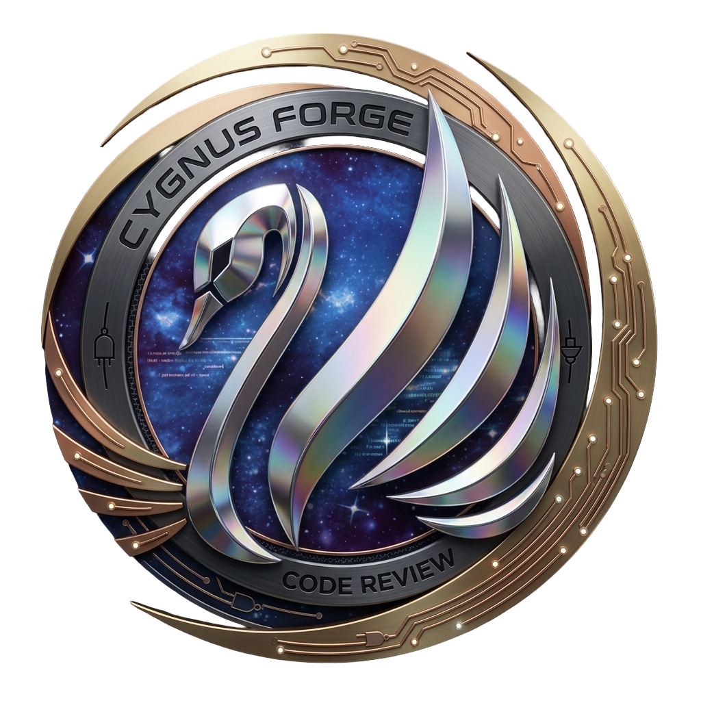

<div id="top"></div>

[![Contributors][contributors-shield]][contributors-url]
[![Forks][forks-shield]][forks-url]
[![Stargazers][stars-shield]][stars-url]
[![Issues][issues-shield]][issues-url]
[![MIT License][license-shield]][license-url]
[![LinkedIn][linkedin-shield]][linkedin-url]

<p align="center">
  
</p>

<h1 align="center">Code Guardian</h1>

<p align="center">
  Análise de código C# automatizada — engine Python + extensão Visual Studio.<br/>
  Detecta vulnerabilidades, code smells e métricas de qualidade diretamente no seu repositório.
</p>

<p align="center">
  <a href="https://github.com/marcosaraujo-dev/code-guardian/issues">Reportar Bug</a>
  ·
  <a href="https://github.com/marcosaraujo-dev/code-guardian/issues">Solicitar Feature</a>
  ·
  <a href="https://cygnusforge.com.br">CygnusForge</a>
</p>

---

## Sobre o Projeto

**Code Guardian** é uma ferramenta de code review automatizado para projetos C#. Combina uma engine de análise estática em Python com integração nativa ao Visual Studio via extensão VSIX.

- **Sem dependência de serviços externos** — roda localmente, sem envio de código para nuvem
- **Integração com git hooks** — bloqueia commits com issues críticos
- **Risk Score** — pontuação de 0 a 100 por arquivo ou solução inteira
- **Extensão Visual Studio** — resultados direto na Error List e no Tool Window

<p align="right">(<a href="#top">back to top</a>)</p>

---

## O que detecta

| Categoria | Exemplos |
|-----------|----------|
| **Segurança** | SQL Injection, secrets hardcoded, path traversal, deserialização insegura |
| **Confiabilidade** | Exception swallowing, catch vazio, loops sem condição de saída |
| **Performance** | Padrão N+1, concatenação de string em loop, ausência de CancellationToken |
| **Clean Code** | God Class, métodos > 30 linhas, nesting > 5 níveis, magic numbers |
| **Async/Await** | `.Result` / `.Wait()` gerando deadlock, fire-and-forget sem tratamento |
| **VB6** | SQL Injection, error handling incorreto, violações de arquitetura clsN/clsD |

<p align="right">(<a href="#top">back to top</a>)</p>

---

## Estrutura do Repositório

```
code-guardian/
├── code_guardian/          # Engine de análise (Python)
│   ├── runner.py           # Orquestrador principal
│   ├── rule_engine.py      # 20+ regras C# (regex)
│   ├── vb6_rule_engine.py  # 20+ regras VB6
│   ├── metrics.py          # Métricas de qualidade
│   ├── diff_parser.py      # Parser de git diff
│   ├── ai_client.py        # Análise via IA (Gemini/Claude/OpenAI/Ollama)
│   ├── spelling_checker.py # Verificação ortográfica em strings
│   ├── install_hooks.py    # Instalador de git hooks
│   └── config.json         # Configuração dos providers de IA
│
├── CodeGuardian.VS/        # Extensão Visual Studio (C# / VSIX)
│   ├── CodeGuardian.VS.sln
│   ├── LICENSE
│   └── src/CodeGuardian.VS/
│
├── review.bat              # Atalho CLI para análise rápida (Windows)
├── test-guardian.bat       # Testes dos scripts Python
└── images/                 # Logos e assets
```

<p align="right">(<a href="#top">back to top</a>)</p>

---

## Pré-requisitos

| Requisito | Versão mínima |
|-----------|--------------|
| Python | 3.8+ |
| Git | qualquer versão recente |
| Visual Studio *(extensão)* | 2019 (16.x) ou 2022 (17.x) |

<p align="right">(<a href="#top">back to top</a>)</p>

---

## Instalação e Uso

### 1. Clonar e configurar

```bash
git clone https://github.com/marcosaraujo-dev/code-guardian.git
```

Copie a pasta `code_guardian/` para a raiz do seu repositório:

```
seu-projeto/
├── code_guardian/      ← copiar aqui
├── src/
└── ...
```

### 2. Uso pela linha de comando

```bash
# Analisar arquivo único
python code_guardian/runner.py --file src/MinhaClasse.cs

# Varrer diretório inteiro
python code_guardian/runner.py --scan --dir ./src

# Analisar apenas o diff staged (pre-commit)
python code_guardian/runner.py --staged

# Apenas regras, sem IA (mais rápido)
python code_guardian/runner.py --scan --rules-only --format json
```

```bash
# Atalho Windows
review.bat
```

### 3. Git Hooks

```bash
python code_guardian/install_hooks.py install
```

Bloqueia o commit automaticamente se houver issues com severidade `critical` ou `error`.

### 4. Extensão Visual Studio

Instale o `.vsix` disponível em [Releases](https://github.com/marcosaraujo-dev/code-guardian/releases) ou pelo [Visual Studio Marketplace](https://marketplace.visualstudio.com/publishers/cygnusforge).

Após instalar:
- **Tools → Code Guardian** — abre o painel com Risk Score e lista de issues
- **Tools → Analyze Current File** — analisa o arquivo `.cs` aberto
- Clique direito na solution → **Analyze with Code Guardian** — scan completo
- **Tools → Code Guardian: Install Git Hooks** — instala o hook no repositório atual

<p align="right">(<a href="#top">back to top</a>)</p>

---

## Configuração da IA

Edite `code_guardian/config.json`:

```json
{
  "ai": {
    "primary": "gemini",
    "fallback": "ollama",
    "gemini": { "model": "gemini-1.5-pro", "api_key_env": "GEMINI_API_KEY" },
    "claude": { "model": "claude-sonnet-4-6", "api_key_env": "ANTHROPIC_API_KEY" },
    "openai": { "model": "gpt-4o", "api_key_env": "OPENAI_API_KEY" },
    "ollama": { "base_url": "http://localhost:11434", "model": "qwen2.5-coder:32b" }
  }
}
```

Sem IA configurada, a engine de regras estáticas continua funcionando normalmente.

<p align="right">(<a href="#top">back to top</a>)</p>

---

## Risk Score

| Score | Classificação | Ação recomendada |
|-------|--------------|-----------------|
| 0–10 | 🟢 Baixo risco | Código em boa forma |
| 11–30 | 🟡 Moderado | Revisar warnings |
| 31–60 | 🟠 Alto risco | Corrigir antes de merge |
| 61–100 | 🔴 Crítico | Bloqueado pelo pre-commit hook |

<p align="right">(<a href="#top">back to top</a>)</p>

---

## Tecnologias


<p align="right">(<a href="#top">back to top</a>)</p>

---

## Contribuindo

1. Fork o repositório
2. Crie sua branch: `git checkout -b feat/minha-feature`
3. Commit: `git commit -m "feat: descrição da feature"`
4. Push: `git push origin feat/minha-feature`
5. Abra um Pull Request

<p align="right">(<a href="#top">back to top</a>)</p>

---

## Contato

Marcos Araujo — [@LinkedIn](https://www.linkedin.com/in/marcosaraujosouza/) — marcos.araso@hotmail.com

Projeto: [github.com/marcosaraujo-dev/code-guardian](https://github.com/marcosaraujo-dev/code-guardian)

Site: [cygnusforge.com.br](https://cygnusforge.com.br)

<p align="right">(<a href="#top">back to top</a>)</p>

---

## Licença

Distribuído sob a licença MIT. Veja [`LICENSE`](LICENSE) para mais informações.

<p align="right">(<a href="#top">back to top</a>)</p>

<!-- MARKDOWN LINKS -->
[contributors-shield]: https://img.shields.io/github/contributors/marcosaraujo-dev/code-guardian.svg?style=for-the-badge
[contributors-url]: https://github.com/marcosaraujo-dev/code-guardian/graphs/contributors
[forks-shield]: https://img.shields.io/github/forks/marcosaraujo-dev/code-guardian.svg?style=for-the-badge
[forks-url]: https://github.com/marcosaraujo-dev/code-guardian/network/members
[stars-shield]: https://img.shields.io/github/stars/marcosaraujo-dev/code-guardian.svg?style=for-the-badge
[stars-url]: https://github.com/marcosaraujo-dev/code-guardian/stargazers
[issues-shield]: https://img.shields.io/github/issues/marcosaraujo-dev/code-guardian.svg?style=for-the-badge
[issues-url]: https://github.com/marcosaraujo-dev/code-guardian/issues
[license-shield]: https://img.shields.io/github/license/marcosaraujo-dev/code-guardian.svg?style=for-the-badge
[license-url]: https://github.com/marcosaraujo-dev/code-guardian/blob/main/LICENSE
[linkedin-shield]: https://img.shields.io/badge/-LinkedIn-black.svg?style=for-the-badge&logo=linkedin&colorB=555
[linkedin-url]: https://www.linkedin.com/in/marcosaraujosouza/
